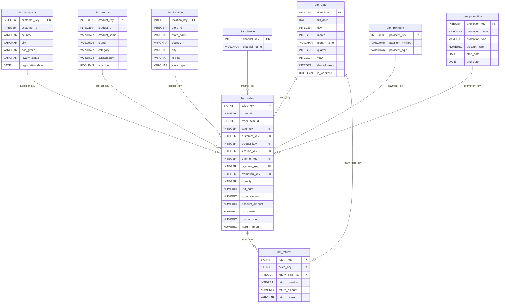

```mermaid
erDiagram
    dim_customer ||--o{ fact_sales : customer_key
    dim_product ||--o{ fact_sales : product_key
    dim_date ||--o{ fact_sales : date_key
    dim_location ||--o{ fact_sales : location_key
    dim_channel ||--o{ fact_sales : channel_key
    dim_payment ||--o{ fact_sales : payment_key
    dim_promotion ||--o{ fact_sales : promotion_key

    fact_sales ||--o{ fact_returns : sales_key
    dim_date ||--o{ fact_returns : return_date_key

    dim_customer {
        INTEGER customer_key PK
        INTEGER customer_id
        VARCHAR country
        VARCHAR city
        VARCHAR age_group
        VARCHAR loyalty_status
        DATE registration_date
    }

    dim_product {
        INTEGER product_key PK
        INTEGER product_id
        VARCHAR product_name
        VARCHAR brand
        VARCHAR category
        VARCHAR subcategory
        BOOLEAN is_active
    }

    dim_date {
        INTEGER date_key PK
        DATE full_date
        INTEGER day
        INTEGER month
        VARCHAR month_name
        INTEGER quarter
        INTEGER year
        INTEGER day_of_week
        BOOLEAN is_weekend
    }

    dim_location {
        INTEGER location_key PK
        INTEGER store_id
        VARCHAR store_name
        VARCHAR country
        VARCHAR city
        VARCHAR region
        VARCHAR store_type
    }

    dim_channel {
        INTEGER channel_key PK
        VARCHAR channel_name
    }

    dim_payment {
        INTEGER payment_key PK
        VARCHAR payment_method
        VARCHAR payment_type
    }

    dim_promotion {
        INTEGER promotion_key PK
        VARCHAR promotion_name
        VARCHAR promotion_type
        NUMERIC discount_rate
        DATE start_date
        DATE end_date
    }

    fact_sales {
        BIGINT sales_key PK
        INTEGER order_id
        BIGINT order_item_id
        INTEGER date_key FK
        INTEGER customer_key FK
        INTEGER product_key FK
        INTEGER location_key FK
        INTEGER channel_key FK
        INTEGER payment_key FK
        INTEGER promotion_key FK
        INTEGER quantity
        NUMERIC unit_price
        NUMERIC gross_amount
        NUMERIC discount_amount
        NUMERIC net_amount
        NUMERIC cost_amount
        NUMERIC margin_amount
    }

    fact_returns {
        BIGINT return_key PK
        BIGINT sales_key FK
        INTEGER return_date_key FK
        INTEGER return_quantity
        NUMERIC return_amount
        VARCHAR return_reason
    }
```